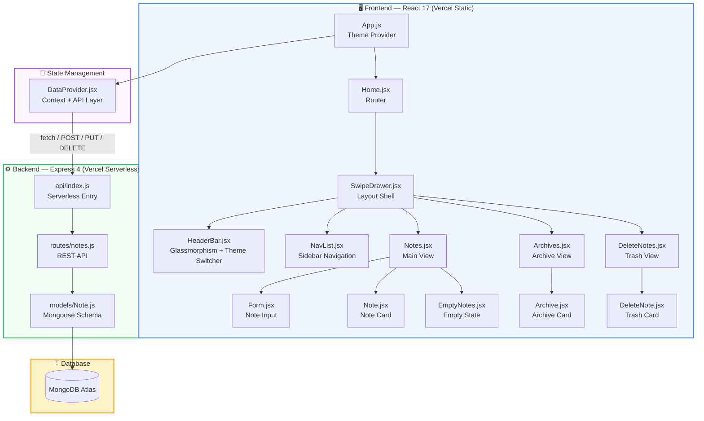

<p align="center">
  
</p>

<h1 align="center">📝 Google Keep Clone</h1>

<p align="center">
  A stunning, full-stack note-taking application inspired by Google Keep — built with <strong>React</strong>, <strong>Material UI</strong>, <strong>DaisyUI</strong> theming, <strong>GSAP</strong> animations, and <strong>MongoDB</strong> persistence.
</p>

<p align="center">
  
  
  
  
  
  
  
  
</p>

---

## ✨ Features

| Feature | Description |
|---------|-------------|
| 📝 **Create Notes** | Quick-add form with title and body — expands on click with smooth GSAP animation |
| 📦 **Archive** | Move notes to archive; unarchive them back to active |
| 🗑️ **Trash & Restore** | Soft-delete to trash, restore or permanently delete |
| 🔀 **Drag & Drop** | Reorder notes with `react-beautiful-dnd` — tilts and scales while dragging |
| 🎨 **4 DaisyUI Themes** | Emerald (light), Night (dark), Cyberpunk, Garden — persisted in `localStorage` |
| 🎬 **GSAP Animations** | ScrollTrigger card reveals, staggered entrances, floating empty-state, elastic effects |
| 💾 **MongoDB Persistence** | All notes synced to MongoDB Atlas via Express REST API |
| 🔄 **Offline Fallback** | Works in local-only mode when the database is unavailable |
| 📱 **Responsive** | Fully responsive layout from mobile to desktop |
| 🪟 **Glassmorphism UI** | Frosted glass header and drawer with `backdrop-filter` |
| 🚀 **Vercel Ready** | Both frontend and backend deployable to Vercel independently |

---

## 🏗️ Architecture



---

## 📁 Folder Structure

```
Google_Keep_Clone/
├── frontend/                       # 🖥️ React Frontend (Vercel Static Deploy)
│   ├── public/
│   │   └── index.html              # SEO-optimized HTML shell
│   ├── src/
│   │   ├── index.js                # ReactDOM entry
│   │   ├── index.css               # Global styles, glassmorphism, animations
│   │   ├── App.js                  # Theme provider + DaisyUI data-theme sync
│   │   ├── components/
│   │   │   ├── Home.jsx            # Router wrapper
│   │   │   ├── HeaderBar.jsx       # App bar with theme dropdown
│   │   │   ├── NavList.jsx         # Sidebar nav (Notes, Archives, Trash)
│   │   │   ├── SwipeDrawer.jsx     # MUI Drawer layout shell
│   │   │   ├── notes/
│   │   │   │   ├── Notes.jsx       # Notes grid + DnD container
│   │   │   │   ├── Note.jsx        # Individual note card
│   │   │   │   ├── Form.jsx        # Create-note form
│   │   │   │   └── EmptyNotes.jsx  # Empty state with floating animation
│   │   │   ├── archives/
│   │   │   │   ├── Archives.jsx    # Archives grid
│   │   │   │   └── Archive.jsx     # Archive card
│   │   │   └── delete/
│   │   │       ├── DeleteNotes.jsx # Trash grid
│   │   │       └── DeleteNote.jsx  # Trash card
│   │   ├── context/
│   │   │   └── DataProvider.jsx    # Global state + MongoDB API layer
│   │   └── utils/
│   │       └── common-utils.js     # Drag-and-drop reorder helper
│   ├── .env                        # REACT_APP_API_URL (local dev)
│   ├── vercel.json                 # Vercel frontend config
│   ├── tailwind.config.js          # TailwindCSS + DaisyUI theme config
│   ├── postcss.config.js           # PostCSS plugins
│   └── package.json                # Frontend dependencies
│
├── backend/                        # ⚙️ Express Backend (Vercel Serverless)
│   ├── api/
│   │   └── index.js                # Express app exported for Vercel
│   ├── models/
│   │   └── Note.js                 # Mongoose schema (heading, text, status)
│   ├── routes/
│   │   └── notes.js                # REST API: GET, POST, PUT, DELETE
│   ├── server.js                   # Local development entry point
│   ├── .env                        # MONGODB_URI (gitignored)
│   ├── vercel.json                 # Vercel serverless config
│   └── package.json                # Backend dependencies
│
├── .gitignore                      # Single gitignore for entire project
└── README.md                       # This file
```

---

## 🚀 Getting Started

### Prerequisites

- **Node.js** ≥ 16
- **npm** ≥ 8
- **MongoDB Atlas** account (or local MongoDB instance)

### 1. Clone the Repository

```bash
git clone https://github.com/your-username/Google_Keep_Clone.git
cd Google_Keep_Clone
```

### 2. Setup Backend

```bash
cd backend
npm install
```

Create a `.env` file in `backend/`:

```env
MONGODB_URI=mongodb+srv://<username>:<password>@<cluster>.mongodb.net/google-keep-clone?retryWrites=true&w=majority
PORT=5000
```

Start the backend:

```bash
npm start
```

### 3. Setup Frontend

```bash
cd frontend
npm install
```

Create a `.env` file in `frontend/`:

```env
REACT_APP_API_URL=http://localhost:5000/api
```

Start the frontend:

```bash
npm start
```

The app opens at `http://localhost:3000` and the API runs at `http://localhost:5000`.

---

## 🌐 Vercel Deployment

### Deploy Backend

1. Push your code to GitHub
2. Go to [vercel.com](https://vercel.com) → **New Project**
3. Select your repo, set **Root Directory** to `backend`
4. Add environment variable: `MONGODB_URI` = your MongoDB connection string
5. Deploy — note the URL (e.g., `https://your-backend.vercel.app`)

### Deploy Frontend

1. Create another Vercel project for the same repo
2. Set **Root Directory** to `frontend`
3. Add environment variable: `REACT_APP_API_URL` = `https://your-backend.vercel.app/api`
4. Deploy

---

## 🔌 API Reference

| Method | Endpoint | Description |
|--------|----------|-------------|
| `GET` | `/api/notes?status=active` | Fetch active notes |
| `GET` | `/api/notes?status=archived` | Fetch archived notes |
| `GET` | `/api/notes?status=deleted` | Fetch trashed notes |
| `POST` | `/api/notes` | Create a new note `{ heading, text }` |
| `PUT` | `/api/notes/:id` | Update note fields `{ heading?, text?, status? }` |
| `DELETE` | `/api/notes/:id` | Permanently delete a note |
| `GET` | `/api/health` | Server + DB health check |

---

## 🎨 Theme System

The app ships with **4 DaisyUI themes** switchable via the header dropdown:

| Theme | Style | Colors |
|-------|-------|--------|
| 🌿 Emerald | Clean & bright | Indigo primary, Cyan secondary |
| 🌙 Night | Dark mode | Soft purple primary, Cyan secondary |
| ⚡ Cyberpunk | Neon vibes | Magenta + Electric blue |
| 🌸 Garden | Soft & warm | Sage green + Gold |

Theme choice is persisted in `localStorage` and synced between DaisyUI (`data-theme`) and Material UI palette.

---

## 🎬 GSAP Animations

| Animation | Component | Trigger |
|-----------|-----------|---------|
| Header slide-down | `HeaderBar` | On mount |
| Nav staggered fade | `NavList` | On mount, 100ms stagger |
| Form scale-in | `Form` | On mount |
| Form expand | `Form` | On click |
| Card reveal | `Note`, `Archive`, `DeleteNote` | ScrollTrigger — enters viewport |
| Staggered grid | `Notes`, `Archives`, `DeleteNotes` | On data change |
| Floating bulb | `EmptyNotes` | Infinite yoyo loop |
| Elastic pop | `EmptyNotes` icon | On mount |
| Drag tilt | `Notes` grid | While dragging |

All animations use `gsap.registerPlugin(ScrollTrigger)` and are cleaned up on unmount.

---

## 🛠️ Tech Stack

| Layer | Technology | Purpose |
|-------|-----------|---------|
| **UI Framework** | React 17 + CRA | Component architecture & build tooling |
| **Component Library** | Material UI 5 | Drawer, AppBar, Cards, Icons, TextField |
| **Styling** | TailwindCSS 3.4 + DaisyUI 4 | Utility classes, theme system, components |
| **Animations** | GSAP 3.12 + ScrollTrigger | Premium motion graphics |
| **Drag & Drop** | react-beautiful-dnd | Note reordering |
| **State** | React Context API | Global note state management |
| **Backend** | Express 4 | REST API server (Vercel serverless) |
| **Database** | MongoDB Atlas + Mongoose | Persistent note storage |
| **Routing** | React Router DOM 6 | Client-side page navigation |
| **Deployment** | Vercel | Frontend static + Backend serverless |
| **IDs** | uuid v4 | Unique note identification |

---

## 🤝 Contributing

1. **Fork** the repository
2. **Create** a feature branch: `git checkout -b feature/my-feature`
3. **Commit** your changes: `git commit -m "Add my feature"`
4. **Push** to the branch: `git push origin feature/my-feature`
5. **Open** a Pull Request

---

## 📄 License

This project is open-source and available under the [MIT License](LICENSE).

---

<p align="center">
  Made with ❤️ using React, Material UI, DaisyUI, GSAP & MongoDB
</p>
